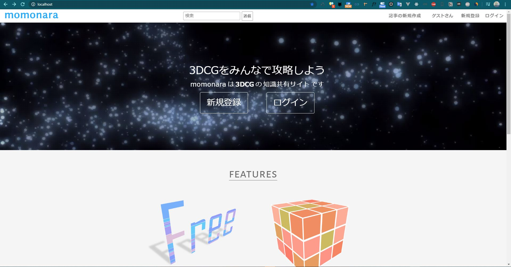

# momonara

学生時代に練習で作成した Laravel を使用した「3DCG の知識共有サイト」。

イメージとしては、qiita の 3dcg 版の用な感じです。



## 注意点

初回起動時にはマイグレーションを行ってください。

```
php artisan migrate
```

Laravel 側で画像や動画などがあるファイルへのアクセスリンクを作成するための下記のコマンドが必要です。

```
php artisan storage:link
```
